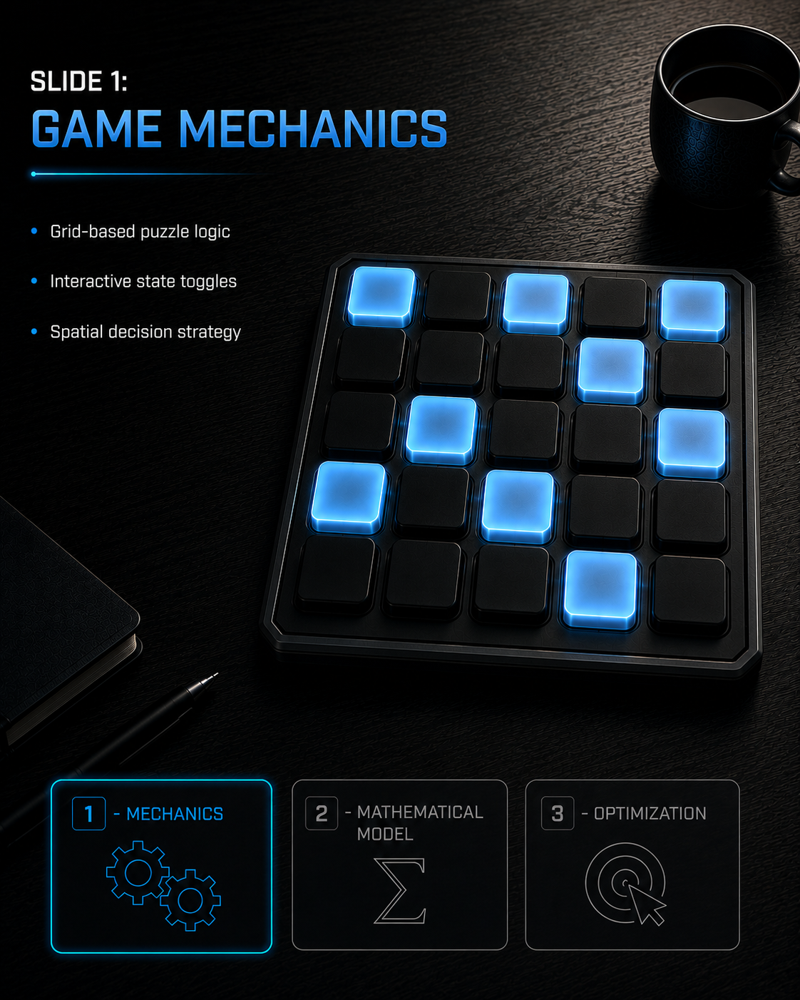
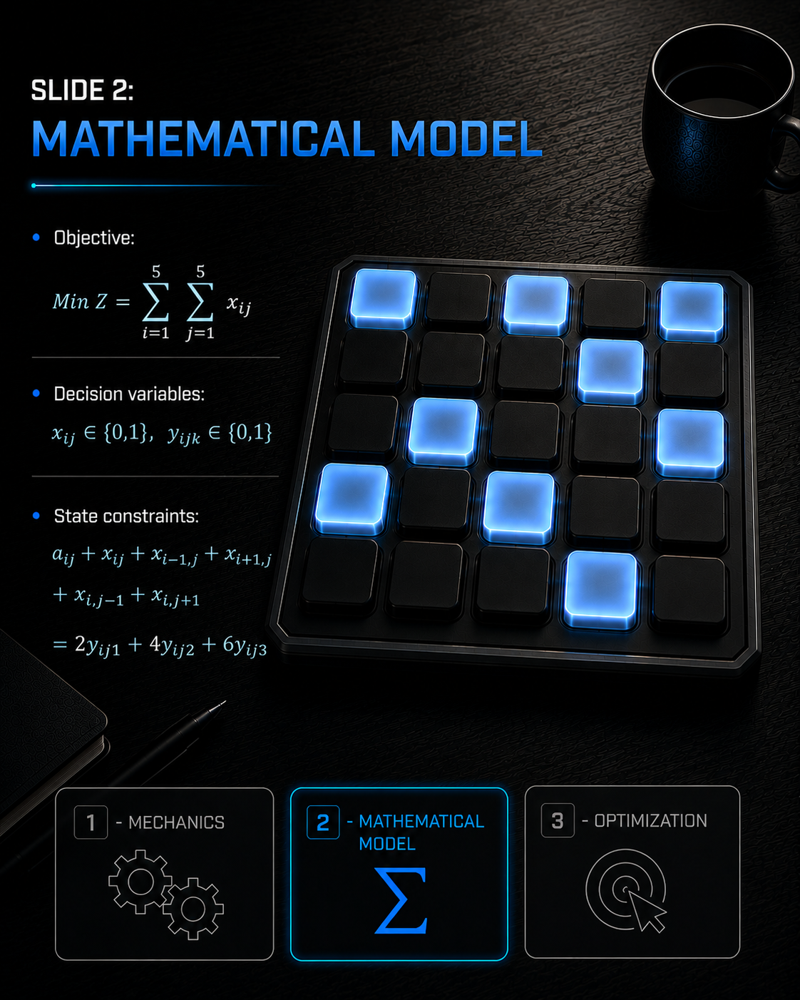
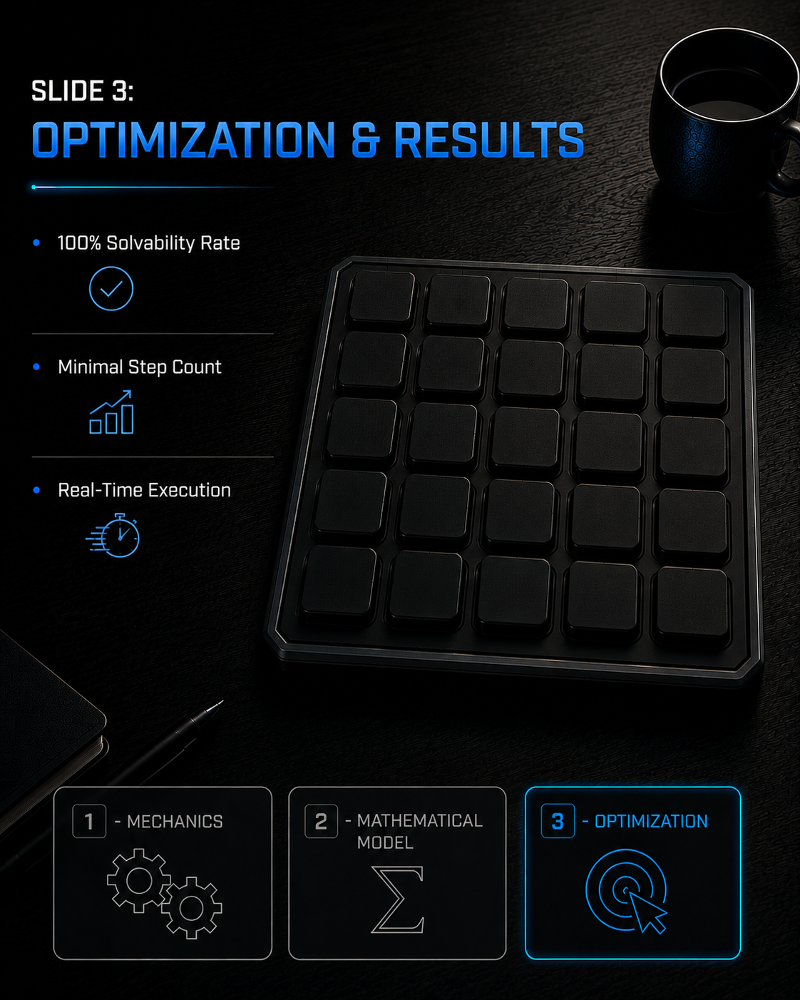

# 🧩 Grid Toggle Puzzle Optimization via Integer Linear Programming (ILP)

[](https://www.gams.com/)
[](https://www.gams.com/)
[](https://opensource.org/licenses/MIT)

An Operations Research approach to solving a $5 \times 5$ grid-based toggle puzzle. This repository contains the **Binary Integer Linear Programming (BILP)** model implemented in **GAMS** (`Grid Puzzle Optimization using Integer Linear Programming.gms`) to determine the exact click pattern that clears the grid with the minimum number of moves.

---

## 1. Problem Description & Mechanics
The puzzle consists of a $5 \times 5$ playable binary grid where cells are either **Active (1)** or **Inactive (0)**.

### Rules & Dynamics:
* **Cell Activation:** Selecting cell $(i,j)$ flips its state as well as its immediate orthogonal neighbors (Up, Down, Left, Right).
* **Binary State Transition:** Since toggling a cell twice reverts it to its original state, decision variables are strictly binary ($x_{i,j} \in \{0,1\}$).
* **Objective:** Find an optimal sequence of clicks to transition from the initial configuration matrix $A$ to a completely cleared board ($\mathbf{0}_{5 \times 5}$) using the **minimum total clicks**.

---

## 2. Mathematical Formulation

To prevent out-of-bounds errors on boundary cells without using complex conditional logic, an extended zero-padded grid domain $\mathcal{U} \times \mathcal{V} = \{0..6\} \times \{0..6\}$ is defined around the core playable area $\mathcal{I} \times \mathcal{J} = \{1..5\} \times \{1..5\}$.

### Sets & Indices
* $u, v \in \{0, 1, \dots, 6\}$: Extended grid domains (with $0$ and $6$ as boundary padding).
* $i(u), j(v) \in \{1, 2, 3, 4, 5\}$: Active $5 \times 5$ playable grid indices.
* $k \in \{1, 2, 3\}$: Parity scaling factors for modulo linearization.

### Parameters & Data
* $a_{u,v} \in \{0,1\}$: Initial state matrix. Active board configuration ($a_{i,j}$):

$$A = \begin{bmatrix} 
0 & 0 & 0 & 1 & 0 \\ 
0 & 0 & 0 & 1 & 1 \\ 
0 & 0 & 0 & 1 & 0 \\ 
0 & 0 & 0 & 1 & 1 \\ 
0 & 0 & 0 & 1 & 0 
\end{bmatrix}$$
### Decision Variables
* $x_{u,v} \in \{0,1\}$: Binary variable; $1$ if cell $(u,v)$ is clicked, $0$ otherwise.
* $y_{i,j,k} \in \{0,1\}$: Auxiliary binary variable used to linearize the even-sum parity condition.
* $Z$: Continuous variable representing total clicks.

---

### Optimization Model

#### **Objective Function**
$$\min Z = \sum_{i=1}^{5} \sum_{j=1}^{5} x_{i,j}$$

#### **Constraints**

1. **Linearized Parity & State Transition Constraint:**
   Ensures that for every playable cell $(i,j)$, the sum of its initial state and all affecting toggles results in an even integer (extinguishing the cell):
   $$2y_{i,j,1} + 4y_{i,j,2} + 6y_{i,j,3} = a_{i,j} + x_{i,j} + x_{i+1,j} + x_{i-1,j} + x_{i,j+1} + x_{i,j-1}, \quad \forall i,j \in \{1..5\}$$

2. **Parity Scaling Mutex:**
   $$\sum_{k=1}^{3} y_{i,j,k} \le 1, \quad \forall i,j \in \{1..5\}$$

---

---

## 3. Computational Implementation & Verification

The model is programmed in **GAMS** and solved using Mixed Integer Programming (MIP).

### File Structure:
```text
.
├── Grid Puzzle Optimization using Integer Linear Programming.gms  # Main GAMS Model
├── 1.png                                                          # Initial Board Setup
├── 2.png                                                          # Mathematical Model Formulation
├── 3.png                                                          # Optimal Decision Matrix Output
├── 4.png                                                          # Final Board Verification
└── README.md                                                      # Documentation
```
### Running the Model:
1. Open `Grid Puzzle Optimization using Integer Linear Programming.gms` in **GAMS Studio**.
2. Run the model using an available MIP solver (e.g., **CPLEX**, **CBC**).
3. Inspect the execution log (`.lst` file) for the level values of `x.L` (optimal click matrix) and `z.L` (minimum total clicks).

---

## 📸 Visual Verification & Results

| Initial Board Setup | Mathematical Formulation |
| :---: | :---: |
|  |  |

| Optimal Decision Matrix ($X^*$) | Extinguished Board Verification |
| :---: | :---: |
|  |  |

---

## 🎓 Academic Context
* **Institution:** University of Tehran
* **Faculty:** Caspian Faculty
* **Department:** Department of Industrial Engineering
* **Course:** Operations Research & Mathematical Optimization
* **Instructor:** Dr. Yaser Malekian
